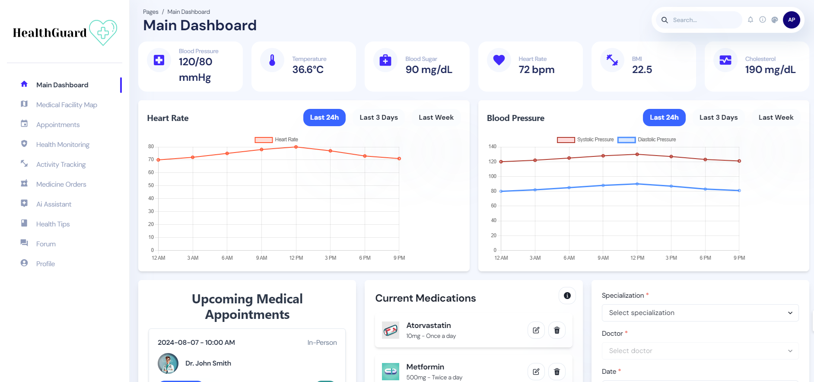
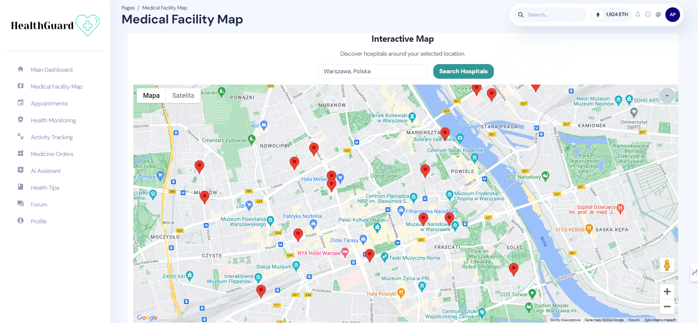

### Project Description: HealthGuard – Intelligent Health Guardian 🛡️💡

#### Project Objective 🎯
**HealthGuard** is an advanced web application leveraging artificial intelligence and modern web technologies to monitor users' health in real-time, provide personalized health advice, and facilitate access to medical services. The project aims to significantly improve users' quality of life through health prevention, personalized care, and increased health awareness. 🌍❤️

#### Technologies Used in the Project 🛠️
- **React.js**: JavaScript library for building user interfaces. ⚛️
- **Redux**: State management for the application. 📦
- **React Router**: Route management within the application. 🗺️
- **Axios**: API communication. 🔗
- **Firebase**: User authentication, database, notifications. 🔥
- **TensorFlow.js**: Health data analysis and health issue prediction. 🤖
- **Material-UI** or **Ant Design**: UI components. 🎨
- **Socket.io**: Real-time functionality. 📡
- **Google Maps API**: Locating health facilities. 🗺️
- **Twilio**: Online medical appointments. 📞
- **Stripe**: Payments for health services and medications. 💳
- **Gemini API**: Integrated for financial analysis of medical services and payments. 💰

#### Application Features 🛠️

1. **Real-time Health Monitoring** ⏱️
   The application integrates with IoT devices such as smartwatches and fitness bands to collect biometric data from the user, including heart rate, stress levels, sleep quality, and physical activity. Data is analyzed in real-time and presented in clear charts and reports. 📈📊  
   - **Impact**: Includes accessibility features adhering to WCAG guidelines, such as screen reader support, keyboard navigation, and customizable contrast and font size options. 🧑‍🦯🔠

2. **Artificial Intelligence for Health Analysis** 🧠
   TensorFlow.js is used for analyzing biometric data. AI models predict potential health issues and provide personalized recommendations on diet, exercise, and other health aspects. 🥗🏋️‍♂️  
   - **Creativity**: Implements advanced predictive models and unique data analysis techniques to enhance accuracy and user engagement. 🚀

3. **Personalized Health Advice** 💬
   Provides personalized health advice based on data analysis to help maintain good physical and mental condition. Tips include dietary recommendations, exercise plans, and relaxation techniques. 🥦🧘‍♀️  
   - **Usefulness**: Offers tailored advice for specific user profiles, such as individuals with chronic conditions or elderly users. 👩‍⚕️👴

4. **Alerts and Notifications** 🔔
   Sends notifications about potential health threats, reminders for medication, scheduled doctor visits, and exercises, based on real-time data analysis. 📅💊  
   - **Uniqueness**: Incorporates proactive alerts based on sophisticated AI predictions and user behavior. 🧩

5. **Virtual Health Assistant** 🤖
   An AI-powered chatbot answers users' questions, offers health support, and provides advice on healthy living. It also helps schedule doctor appointments and manage the health diary. 📘🗓️  
   - **Creativity**: Features an intuitive chatbot interface with advanced conversational AI to assist users effectively. 🗣️

6. **Integration with Google Fit and Apple Health** 📱
   Synchronizes data with popular health platforms like Google Fit and Apple Health for comprehensive health monitoring. 🌐  
   - **Usefulness**: Seamless integration with existing health ecosystems to provide a holistic view of user health. 🌟

7. **Health and Social Challenges** 🏆
   Motivates users to engage in physical activity through health challenges, enabling group creation and competition with friends. 👥🎯  
   - **Creativity**: Uses gamification techniques to boost user engagement and motivation. 🎮

8. **Scheduling Doctor Appointments** 🩺
   Allows users to schedule in-person and online doctor appointments directly from the app, with reminders for upcoming visits. 📅🕒  
   - **Impact**: Simplifies the appointment scheduling process, improving access to healthcare services. 🏥

9. **Health Facility Map** 🗺️
   Utilizes Google Maps API to locate nearby health facilities. Users can view ratings and compare medical service offers in different countries. 🌍  
   - **Usefulness**: Enhances user experience by providing comprehensive information on health facilities. 🏨

10. **Medical Offer Comparison** 🔍
    Compares medical offers in various countries, including cost and service availability. 💵🌐  
    - **Impact**: Helps users make informed decisions about their healthcare based on cost and quality. 📊

11. **Medication Ordering for Chronic Diseases** 💊
    Enables automatic ordering of medications for chronic diseases, with reminders to take medications and monitoring of medication supplies. 📦  
    - **Uniqueness**: Integrates automated medication management to ensure users never run out of essential medicines. 🚀

12. **Health Diary** 📓
    Allows users to log medications taken each day, note symptoms, and track well-being, assisting with therapy monitoring and doctor consultations. 📝🩺  
    - **Usefulness**: Provides a comprehensive tool for managing personal health records. 📚

13. **Health Forum** 💬
    Offers a moderated forum where users can exchange health experiences and advice, with expert support from health professionals. 👩‍⚕️👨‍⚕️  
    - **Creativity**: Creates a community-driven space for health discussions and support. 🌐

14. **Integrated Payments and Financial Analysis** 💳
    Utilizes Gemini API for:
    - **Medical Service Cost Analysis**: Analyzes and compares costs of medical services from different facilities, presented in charts and reports. 📊
    - **Payments for Health Services**: Facilitates secure, fast payments for health services directly from the application. 💨
    - **Tracking Health Expenditures**: Automatically categorizes and records health expenses, helping manage the health budget. 📉
    - **Financial Planning**: Provides forecasts and recommendations for future health expenditures, assisting users in managing their healthcare finances. 📈

#### Target Users and Potential Beneficiaries 🧑‍🤝‍🧑
**HealthGuard** is designed for a wide range of users including:
- **General Public**: Individuals seeking to monitor their health and receive personalized advice for better wellness. 🏃‍♀️🧘
- **Chronic Disease Patients**: Those managing chronic conditions who need regular medication reminders and health monitoring. 💊🩺
- **Elderly Individuals**: Seniors who require regular health checks and personalized care recommendations. 👵👴
- **Health Enthusiasts**: People interested in tracking their physical activities and engaging in health challenges. 🚴‍♂️🎽
- **Healthcare Providers**: Medical professionals who may use the application to track patient data and facilitate consultations. 🏥👨‍⚕️

The application benefits users by enhancing their ability to manage their health proactively, offering convenience in scheduling medical services, and providing valuable insights through financial analysis. 💪📅

#### Short-term Vision 🚀
In the short term, HealthGuard aims to implement core features such as health monitoring, personalized advice, and appointment scheduling. The MVP (Minimum Viable Product) will be tested with a closed user group to gather feedback and make necessary improvements. 📋🧪

#### Long-term Vision 🌟
In the long term, HealthGuard aims to evolve into a comprehensive health platform offering extensive health-related services. Planned enhancements include full integration with various IoT devices, more sophisticated AI models for health predictions, expanded social functionalities, and new modules for diet and workout management. The vision also includes global deployment and collaboration with international medical and technology partners. 🌐🤝
